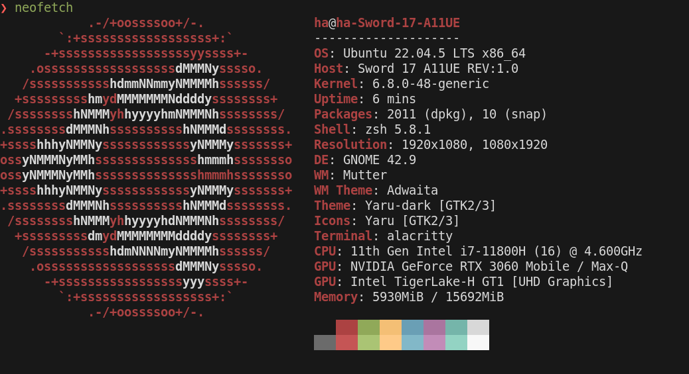
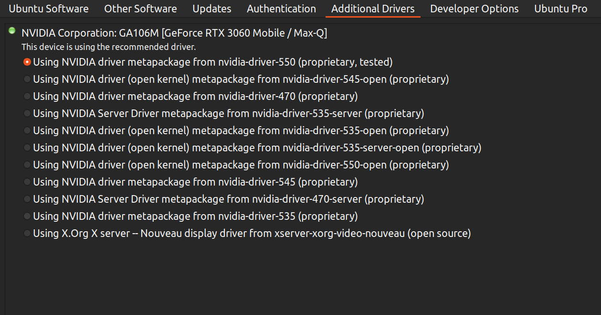

# AIPro iNet Solution Guide for Ubuntu Nvidia GPU v1.1 (English)

+ **Document version**: v1.1
+ **Date**: 2024-11-19
+ **Author**: [HaHV](mailto:hoangvanhauit@gmail.com)

## General information

### Source code and documents

+ Link: [AIProCo/iNet-API-Demo](https://github.com/AIProCo/iNet-API-Demo)
+ This guild file could found in iNet source code at `docs`

### Dev environments (envs)

+ Ubuntu 22.04 LTS
  + You can install Ubuntu using this [guide](https://www.youtube.com/watch?v=mXyN1aJYefc&ab_channel=Robtech)
  + You can install Nvidia driver using this [guide](https://www.youtube.com/watch?v=OFWKevbjDPU&ab_channel=Abstractprogrammer)
+ Cuda 12.1.0
+ cuDNN 8.9.6
+ OpenCV-4.9.0 (included)
+ TensorRT-8.6.1.6 (included)
+ OpenVINO 2023.2 (included)
+ <font color="#c00000">GCC 13</font> (C++ complier) <font color="#c00000">required</font> due to iNet used `std::format` in C++ 20 standards
+ C++ build tool `CMake` with minimum VERSION 3.10 (tested with version 3.22.1 in this guide)

The following image is the test environment for this guide:




## Technical Guides

> **Notice**:
>
>+ All paths in this guide is relative path  to `iNet-API-Demo` folder.
>
>+ BEFORE running a script file (.sh), make sure it allowed to run by execute this command: `sudo chmod +x script.sh`
>
>+ when run CMake, make sure you specify gcc-13:
>`cmake -S . -B build -DCMAKE_C_COMPILER=/usr/bin/gcc-13 -DCMAKE_CXX_COMPILER=/usr/bin/g++-13 ...<other_args>...`


### Step 1 : Install C++ complier GCC 13 and dependencies

+ [original guide](https://int-i.github.io/cpp/2021-07-10/ubuntu-gcc-11/)

+ run these cmd:

```shell
sudo add-apt-repository ppa:ubuntu-toolchain-r/test
sudo apt-get update
sudo apt-get install gcc-13 g++-13
# test
gcc-13 --version
```

+ Install dependent libs: note that tbb (Intel oneAPI Threading Building Blocks) may not be installed by default, so you need to install it manually.

```shell
sudo apt install cmake libtbb2 g++ wget unzip ffmpeg libgtk2.0-dev libavformat-dev libavcodec-dev libavutil-dev libswscale-dev libtbb-dev libjpeg-dev libpng-dev libtiff-dev
```

### Step 2: Install Cuda 12.1 for Ubuntu 22.04

+ Install Cuda by  following this official video  [CUDA Tutorials I Installing CUDA Toolkit on Windows and WSL - YouTube](https://www.youtube.com/watch?v=JaHVsZa2jTc&ab_channel=NVIDIADeveloper) with the `.run` file downloaded from [CUDA Toolkit Archive](https://developer.nvidia.com/cuda-12-1-0-download-archive?target_os=Linux&target_arch=x86_64&Distribution=Ubuntu&target_version=22.04).
  + Note that if we already install Nvidia driver (using `Additional Drivers` in Ubuntu), we should **NOT** install Nvidia driver again when installing Cuda Toolkit.

+ Add Cuda to system `PATH` and `LD_LIBRARY_PATH`

```shell
export PATH=/usr/local/cuda-12.1/bin:$PATH
export LD_LIBRARY_PATH=/usr/local/cuda-12.1/lib64:$LD_LIBRARY_PATH

```

### Step 3: Install cuDNN 8.9.6 using Tar file

+ Install `cuDNN` using `.tar` file with this [guide](https://docs.nvidia.com/deeplearning/cudnn/archives/cudnn-895/install-guide/index.html#installlinux-tar) where `.tar` file can be downloaded at [cuDNN Archive](https://developer.nvidia.com/rdp/cudnn-archive)

Choose `Download cuDNN v8.9.6 (November 1st, 2023), for CUDA 12.x` and download `cuDNN Library for Linux x86_64 (Tar)`.

```bash
tar -xvf cudnn-linux-x86_64-8.9.6.50_cuda12-archive.tar.xz
sudo cp cudnn-*-archive/include/cudnn*.h /usr/local/cuda-12.1/include
sudo cp -P cudnn-*-archive/lib/libcudnn* /usr/local/cuda-12.1/lib64
sudo chmod a+r /usr/local/cuda/include/cudnn*.h /usr/local/cuda-12.1/lib64/libcudnn*

```

### Step 4: Download and extract necessary files

+ Download and upzip one of the followings zip files. Each zip files has 3 directories after unzip: `bin`, `inputs`, and `videos`.<font color="#c00000"> Then, copy and paste `bin` directory to the solution directory (the directory including the .sln file). Move `inputs` and `videos` to the `bin` directory </font>.
  + Cuda compute capability of your GPU should be 8.6 (RTX-30xx) or 8.9 (RTX-40xx):
    + [RTX-30xx](https://drive.google.com/drive/folders/1vteFaTs42lWt_OP5GT0dhDPymNaoA2vw?usp=sharing)
    + [RTX-40xx](https://drive.google.com/drive/folders/1BOkc6lzTf81BbqlR0HYVk7jm6WGP9llJ?usp=drive_link)

### Step 8: Build and run iNet framework on WSL

> **NOTE**: If you want to build for `CPU`, the flag in `CMakeLists.txt` must be turn ON
> `set (BUILD_FOR_CPU ON)`

+ Check and modify  the contents of the `CMakeLists.txt` files if needed. Make sure configs correct, especially for *header file directories* and *lib file directories*.

+ Run `build.sh [-force] [-debug]` to build/rebuild from scratch or enable debug mode.
  + Note that the executable file (`client`) are automatically copied to `bin` folder after build process.
+ Make sure `inputs` folder (with `config.json` and `.net` mode files) and `videos` folder are moved/copied into `bin` folder.
  + Run `client`:
    + `cd bin`
    + `./client`
